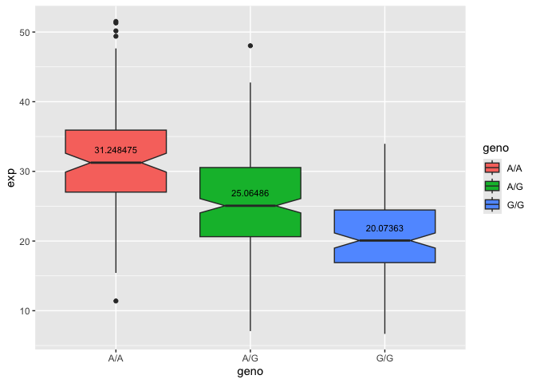

# Population Scale Analysis
Jessica PID: A15647602

### Section 4: Population Scale Analysis

> Q13: Read this file into R and determine the sample size for each
> genotype and their corresponding median expression levels for each of
> these genotypes.

Answer: The sample size for each genotype is A/A = 108 samples, A/G =
233 samples, and G/G = 121 samples. The median expression levels for
each genotype is A/A = 31.25, A/G = 25.06, and G/G = 20.07.

``` r
expr <- read.table("rs8067378_ENSG00000172057.6.txt")
head(expr)
```

       sample geno      exp
    1 HG00367  A/G 28.96038
    2 NA20768  A/G 20.24449
    3 HG00361  A/A 31.32628
    4 HG00135  A/A 34.11169
    5 NA18870  G/G 18.25141
    6 NA11993  A/A 32.89721

``` r
nrow(expr)
```

    [1] 462

``` r
library(plyr)
table(expr$geno)
```


    A/A A/G G/G 
    108 233 121 

``` r
exp_meds <- ddply(expr, .(geno), summarise, med = median(exp))
exp_meds
```

      geno      med
    1  A/A 31.24847
    2  A/G 25.06486
    3  G/G 20.07363

> Q14: Generate a boxplot with a box per genotype, what could you infer
> from the relative expression value between A/A and G/G displayed in
> this plot? Does the SNP effect the expression of ORMDL3?

Answer. From observing the expression levels of A/A and G/G you can
infer that the G/G genotype SNP lowers the expression of the ORMDL3
gene. Additionally, the A/A genotype induces a higher expression of the
ORMDL3 gene.

``` r
library(ggplot2)

ggplot(expr, aes(x = geno, y = exp, fill = geno)) + 
  geom_boxplot(notch = TRUE) + 
  geom_text(data = exp_meds, 
            aes(x = geno, y = med, label = med), size = 3, vjust = -1.5)
```


