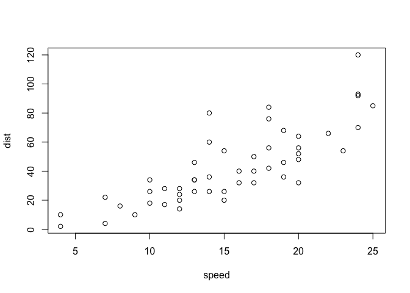
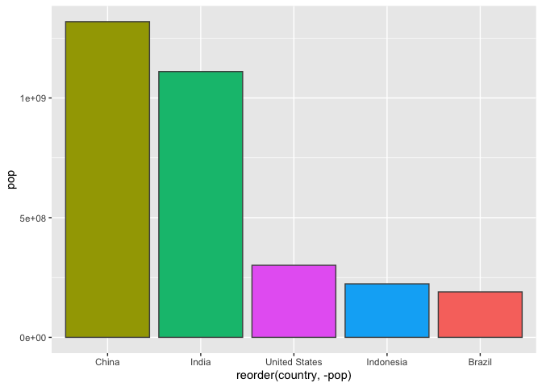

# Class 5: Data Viz with ggplot
Jessica (PID: A15647602)

R has lots of ways to make figures and graphs **“Base” R** - the
`plot()` funciton

``` r
plot(cars) 
```



A very popular package is **ggplot2** Before I can use any package, i
need to install it; `install.packages("ggplot2")` command/function.

Then to use the package I need to load it as `library(ggplot2)`

``` r
library(ggplot2)
ggplot(cars) + aes( x = speed, y = dist) + geom_point()
```


For “simple” plots like this one base R code will be much better than
ggplot code

Let’s fit a model and show it on my plot.

``` r
ggplot(cars) + 
  aes( x = speed, y = dist) + 
  geom_point() + 
  geom_smooth()
```

    `geom_smooth()` using method = 'loess' and formula = 'y ~ x'


``` r
ggplot(cars) + 
  aes( x = speed, y = dist) + 
  geom_point() + 
  labs(title = "Speed and Stopping Distances of Cars", 
       x = "Speed (MPH)", 
       y = "Stopping Distance (ft)", 
       subtitle = "Correlation between stopping distance and speed ofcars",
       caption = "Dataset: 'cars'") +
  geom_smooth(method = "lm", se = FALSE)
```

    `geom_smooth()` using formula = 'y ~ x'


``` r
theme_bw()
```

    List of 136
     $ line                            :List of 6
      ..$ colour       : chr "black"
      ..$ linewidth    : num 0.5
      ..$ linetype     : num 1
      ..$ lineend      : chr "butt"
      ..$ arrow        : logi FALSE
      ..$ inherit.blank: logi TRUE
      ..- attr(*, "class")= chr [1:2] "element_line" "element"
     $ rect                            :List of 5
      ..$ fill         : chr "white"
      ..$ colour       : chr "black"
      ..$ linewidth    : num 0.5
      ..$ linetype     : num 1
      ..$ inherit.blank: logi TRUE
      ..- attr(*, "class")= chr [1:2] "element_rect" "element"
     $ text                            :List of 11
      ..$ family       : chr ""
      ..$ face         : chr "plain"
      ..$ colour       : chr "black"
      ..$ size         : num 11
      ..$ hjust        : num 0.5
      ..$ vjust        : num 0.5
      ..$ angle        : num 0
      ..$ lineheight   : num 0.9
      ..$ margin       : 'margin' num [1:4] 0points 0points 0points 0points
      .. ..- attr(*, "unit")= int 8
      ..$ debug        : logi FALSE
      ..$ inherit.blank: logi TRUE
      ..- attr(*, "class")= chr [1:2] "element_text" "element"
     $ title                           : NULL
     $ aspect.ratio                    : NULL
     $ axis.title                      : NULL
     $ axis.title.x                    :List of 11
      ..$ family       : NULL
      ..$ face         : NULL
      ..$ colour       : NULL
      ..$ size         : NULL
      ..$ hjust        : NULL
      ..$ vjust        : num 1
      ..$ angle        : NULL
      ..$ lineheight   : NULL
      ..$ margin       : 'margin' num [1:4] 2.75points 0points 0points 0points
      .. ..- attr(*, "unit")= int 8
      ..$ debug        : NULL
      ..$ inherit.blank: logi TRUE
      ..- attr(*, "class")= chr [1:2] "element_text" "element"
     $ axis.title.x.top                :List of 11
      ..$ family       : NULL
      ..$ face         : NULL
      ..$ colour       : NULL
      ..$ size         : NULL
      ..$ hjust        : NULL
      ..$ vjust        : num 0
      ..$ angle        : NULL
      ..$ lineheight   : NULL
      ..$ margin       : 'margin' num [1:4] 0points 0points 2.75points 0points
      .. ..- attr(*, "unit")= int 8
      ..$ debug        : NULL
      ..$ inherit.blank: logi TRUE
      ..- attr(*, "class")= chr [1:2] "element_text" "element"
     $ axis.title.x.bottom             : NULL
     $ axis.title.y                    :List of 11
      ..$ family       : NULL
      ..$ face         : NULL
      ..$ colour       : NULL
      ..$ size         : NULL
      ..$ hjust        : NULL
      ..$ vjust        : num 1
      ..$ angle        : num 90
      ..$ lineheight   : NULL
      ..$ margin       : 'margin' num [1:4] 0points 2.75points 0points 0points
      .. ..- attr(*, "unit")= int 8
      ..$ debug        : NULL
      ..$ inherit.blank: logi TRUE
      ..- attr(*, "class")= chr [1:2] "element_text" "element"
     $ axis.title.y.left               : NULL
     $ axis.title.y.right              :List of 11
      ..$ family       : NULL
      ..$ face         : NULL
      ..$ colour       : NULL
      ..$ size         : NULL
      ..$ hjust        : NULL
      ..$ vjust        : num 1
      ..$ angle        : num -90
      ..$ lineheight   : NULL
      ..$ margin       : 'margin' num [1:4] 0points 0points 0points 2.75points
      .. ..- attr(*, "unit")= int 8
      ..$ debug        : NULL
      ..$ inherit.blank: logi TRUE
      ..- attr(*, "class")= chr [1:2] "element_text" "element"
     $ axis.text                       :List of 11
      ..$ family       : NULL
      ..$ face         : NULL
      ..$ colour       : chr "grey30"
      ..$ size         : 'rel' num 0.8
      ..$ hjust        : NULL
      ..$ vjust        : NULL
      ..$ angle        : NULL
      ..$ lineheight   : NULL
      ..$ margin       : NULL
      ..$ debug        : NULL
      ..$ inherit.blank: logi TRUE
      ..- attr(*, "class")= chr [1:2] "element_text" "element"
     $ axis.text.x                     :List of 11
      ..$ family       : NULL
      ..$ face         : NULL
      ..$ colour       : NULL
      ..$ size         : NULL
      ..$ hjust        : NULL
      ..$ vjust        : num 1
      ..$ angle        : NULL
      ..$ lineheight   : NULL
      ..$ margin       : 'margin' num [1:4] 2.2points 0points 0points 0points
      .. ..- attr(*, "unit")= int 8
      ..$ debug        : NULL
      ..$ inherit.blank: logi TRUE
      ..- attr(*, "class")= chr [1:2] "element_text" "element"
     $ axis.text.x.top                 :List of 11
      ..$ family       : NULL
      ..$ face         : NULL
      ..$ colour       : NULL
      ..$ size         : NULL
      ..$ hjust        : NULL
      ..$ vjust        : num 0
      ..$ angle        : NULL
      ..$ lineheight   : NULL
      ..$ margin       : 'margin' num [1:4] 0points 0points 2.2points 0points
      .. ..- attr(*, "unit")= int 8
      ..$ debug        : NULL
      ..$ inherit.blank: logi TRUE
      ..- attr(*, "class")= chr [1:2] "element_text" "element"
     $ axis.text.x.bottom              : NULL
     $ axis.text.y                     :List of 11
      ..$ family       : NULL
      ..$ face         : NULL
      ..$ colour       : NULL
      ..$ size         : NULL
      ..$ hjust        : num 1
      ..$ vjust        : NULL
      ..$ angle        : NULL
      ..$ lineheight   : NULL
      ..$ margin       : 'margin' num [1:4] 0points 2.2points 0points 0points
      .. ..- attr(*, "unit")= int 8
      ..$ debug        : NULL
      ..$ inherit.blank: logi TRUE
      ..- attr(*, "class")= chr [1:2] "element_text" "element"
     $ axis.text.y.left                : NULL
     $ axis.text.y.right               :List of 11
      ..$ family       : NULL
      ..$ face         : NULL
      ..$ colour       : NULL
      ..$ size         : NULL
      ..$ hjust        : num 0
      ..$ vjust        : NULL
      ..$ angle        : NULL
      ..$ lineheight   : NULL
      ..$ margin       : 'margin' num [1:4] 0points 0points 0points 2.2points
      .. ..- attr(*, "unit")= int 8
      ..$ debug        : NULL
      ..$ inherit.blank: logi TRUE
      ..- attr(*, "class")= chr [1:2] "element_text" "element"
     $ axis.text.theta                 : NULL
     $ axis.text.r                     :List of 11
      ..$ family       : NULL
      ..$ face         : NULL
      ..$ colour       : NULL
      ..$ size         : NULL
      ..$ hjust        : num 0.5
      ..$ vjust        : NULL
      ..$ angle        : NULL
      ..$ lineheight   : NULL
      ..$ margin       : 'margin' num [1:4] 0points 2.2points 0points 2.2points
      .. ..- attr(*, "unit")= int 8
      ..$ debug        : NULL
      ..$ inherit.blank: logi TRUE
      ..- attr(*, "class")= chr [1:2] "element_text" "element"
     $ axis.ticks                      :List of 6
      ..$ colour       : chr "grey20"
      ..$ linewidth    : NULL
      ..$ linetype     : NULL
      ..$ lineend      : NULL
      ..$ arrow        : logi FALSE
      ..$ inherit.blank: logi TRUE
      ..- attr(*, "class")= chr [1:2] "element_line" "element"
     $ axis.ticks.x                    : NULL
     $ axis.ticks.x.top                : NULL
     $ axis.ticks.x.bottom             : NULL
     $ axis.ticks.y                    : NULL
     $ axis.ticks.y.left               : NULL
     $ axis.ticks.y.right              : NULL
     $ axis.ticks.theta                : NULL
     $ axis.ticks.r                    : NULL
     $ axis.minor.ticks.x.top          : NULL
     $ axis.minor.ticks.x.bottom       : NULL
     $ axis.minor.ticks.y.left         : NULL
     $ axis.minor.ticks.y.right        : NULL
     $ axis.minor.ticks.theta          : NULL
     $ axis.minor.ticks.r              : NULL
     $ axis.ticks.length               : 'simpleUnit' num 2.75points
      ..- attr(*, "unit")= int 8
     $ axis.ticks.length.x             : NULL
     $ axis.ticks.length.x.top         : NULL
     $ axis.ticks.length.x.bottom      : NULL
     $ axis.ticks.length.y             : NULL
     $ axis.ticks.length.y.left        : NULL
     $ axis.ticks.length.y.right       : NULL
     $ axis.ticks.length.theta         : NULL
     $ axis.ticks.length.r             : NULL
     $ axis.minor.ticks.length         : 'rel' num 0.75
     $ axis.minor.ticks.length.x       : NULL
     $ axis.minor.ticks.length.x.top   : NULL
     $ axis.minor.ticks.length.x.bottom: NULL
     $ axis.minor.ticks.length.y       : NULL
     $ axis.minor.ticks.length.y.left  : NULL
     $ axis.minor.ticks.length.y.right : NULL
     $ axis.minor.ticks.length.theta   : NULL
     $ axis.minor.ticks.length.r       : NULL
     $ axis.line                       : list()
      ..- attr(*, "class")= chr [1:2] "element_blank" "element"
     $ axis.line.x                     : NULL
     $ axis.line.x.top                 : NULL
     $ axis.line.x.bottom              : NULL
     $ axis.line.y                     : NULL
     $ axis.line.y.left                : NULL
     $ axis.line.y.right               : NULL
     $ axis.line.theta                 : NULL
     $ axis.line.r                     : NULL
     $ legend.background               :List of 5
      ..$ fill         : NULL
      ..$ colour       : logi NA
      ..$ linewidth    : NULL
      ..$ linetype     : NULL
      ..$ inherit.blank: logi TRUE
      ..- attr(*, "class")= chr [1:2] "element_rect" "element"
     $ legend.margin                   : 'margin' num [1:4] 5.5points 5.5points 5.5points 5.5points
      ..- attr(*, "unit")= int 8
     $ legend.spacing                  : 'simpleUnit' num 11points
      ..- attr(*, "unit")= int 8
     $ legend.spacing.x                : NULL
     $ legend.spacing.y                : NULL
     $ legend.key                      : NULL
     $ legend.key.size                 : 'simpleUnit' num 1.2lines
      ..- attr(*, "unit")= int 3
     $ legend.key.height               : NULL
     $ legend.key.width                : NULL
     $ legend.key.spacing              : 'simpleUnit' num 5.5points
      ..- attr(*, "unit")= int 8
     $ legend.key.spacing.x            : NULL
     $ legend.key.spacing.y            : NULL
     $ legend.frame                    : NULL
     $ legend.ticks                    : NULL
     $ legend.ticks.length             : 'rel' num 0.2
     $ legend.axis.line                : NULL
     $ legend.text                     :List of 11
      ..$ family       : NULL
      ..$ face         : NULL
      ..$ colour       : NULL
      ..$ size         : 'rel' num 0.8
      ..$ hjust        : NULL
      ..$ vjust        : NULL
      ..$ angle        : NULL
      ..$ lineheight   : NULL
      ..$ margin       : NULL
      ..$ debug        : NULL
      ..$ inherit.blank: logi TRUE
      ..- attr(*, "class")= chr [1:2] "element_text" "element"
     $ legend.text.position            : NULL
     $ legend.title                    :List of 11
      ..$ family       : NULL
      ..$ face         : NULL
      ..$ colour       : NULL
      ..$ size         : NULL
      ..$ hjust        : num 0
      ..$ vjust        : NULL
      ..$ angle        : NULL
      ..$ lineheight   : NULL
      ..$ margin       : NULL
      ..$ debug        : NULL
      ..$ inherit.blank: logi TRUE
      ..- attr(*, "class")= chr [1:2] "element_text" "element"
     $ legend.title.position           : NULL
     $ legend.position                 : chr "right"
     $ legend.position.inside          : NULL
     $ legend.direction                : NULL
     $ legend.byrow                    : NULL
     $ legend.justification            : chr "center"
     $ legend.justification.top        : NULL
     $ legend.justification.bottom     : NULL
     $ legend.justification.left       : NULL
     $ legend.justification.right      : NULL
     $ legend.justification.inside     : NULL
     $ legend.location                 : NULL
     $ legend.box                      : NULL
     $ legend.box.just                 : NULL
     $ legend.box.margin               : 'margin' num [1:4] 0cm 0cm 0cm 0cm
      ..- attr(*, "unit")= int 1
     $ legend.box.background           : list()
      ..- attr(*, "class")= chr [1:2] "element_blank" "element"
     $ legend.box.spacing              : 'simpleUnit' num 11points
      ..- attr(*, "unit")= int 8
      [list output truncated]
     - attr(*, "class")= chr [1:2] "theme" "gg"
     - attr(*, "complete")= logi TRUE
     - attr(*, "validate")= logi TRUE

Every ggplot has at least 3 layers

- **data** (data.frame - the numbers or stuff you want to plot)
- **aes**thetics (mapping of your data columns to your plot, position,
  size, line type, line width, color, shape)
- **geom**s (`geom_point()`, `geom_line()`, `geom_col()`)

``` r
head(mtcars)
```

                       mpg cyl disp  hp drat    wt  qsec vs am gear carb
    Mazda RX4         21.0   6  160 110 3.90 2.620 16.46  0  1    4    4
    Mazda RX4 Wag     21.0   6  160 110 3.90 2.875 17.02  0  1    4    4
    Datsun 710        22.8   4  108  93 3.85 2.320 18.61  1  1    4    1
    Hornet 4 Drive    21.4   6  258 110 3.08 3.215 19.44  1  0    3    1
    Hornet Sportabout 18.7   8  360 175 3.15 3.440 17.02  0  0    3    2
    Valiant           18.1   6  225 105 2.76 3.460 20.22  1  0    3    1

``` r
#Make me a ggplot of the `mtcars` data set using `mpg` vs `disp` and set the size of the points to the `hp` and set the color to `am`

ggplot(mtcars) + 
  aes(x = mpg, y = disp, size = hp, col = am ) + 
  geom_point() +
  facet_wrap(~am)
```


``` r
ggplot(mtcars) +
  aes(x = mpg, y = disp, size = hp, col = am) + 
  geom_point(col = "blue")
```


``` r
#install.packages(ggrepel)
library(ggrepel)

ggplot(mtcars) +
  aes(x = mpg, y = disp, size = hp, col = am, label = rownames(mtcars)) +
  geom_point()+
  geom_text_repel()
```


``` r
url <- "https://bioboot.github.io/bimm143_S20/class-material/up_down_expression.txt"
genes <- read.delim(url)
head(genes)
```

            Gene Condition1 Condition2      State
    1      A4GNT -3.6808610 -3.4401355 unchanging
    2       AAAS  4.5479580  4.3864126 unchanging
    3      AASDH  3.7190695  3.4787276 unchanging
    4       AATF  5.0784720  5.0151916 unchanging
    5       AATK  0.4711421  0.5598642 unchanging
    6 AB015752.4 -3.6808610 -3.5921390 unchanging

``` r
nrow(genes)
```

    [1] 5196

``` r
colnames(genes)
```

    [1] "Gene"       "Condition1" "Condition2" "State"     

``` r
ncol(genes)
```

    [1] 4

``` r
table(genes$State)
```


          down unchanging         up 
            72       4997        127 

``` r
round(table(genes$State)/nrow(genes)*100, 2)
```


          down unchanging         up 
          1.39      96.17       2.44 

``` r
ggplot(genes) +
  aes(x = Condition1, y = Condition2) +
  geom_point()
```


``` r
p <- ggplot(genes) + 
    aes(x=Condition1, y=Condition2, col=State) +
    geom_point()
p + scale_colour_manual( values=c("blue","gray","red")) +
  labs(title = "Gene Expression Changes Upon Drug Treatment",
       x = "Control (no drug)",
       y = "Drug Treatment")
```


``` r
# File location online
url <- "https://raw.githubusercontent.com/jennybc/gapminder/master/inst/extdata/gapminder.tsv"

gapminder <- read.delim(url)
```

\#install.packages(dplyr)

``` r
library(dplyr)
```


    Attaching package: 'dplyr'

    The following objects are masked from 'package:stats':

        filter, lag

    The following objects are masked from 'package:base':

        intersect, setdiff, setequal, union

``` r
gapminder_2007 <- gapminder %>% filter(year==2007)

ggplot(gapminder_2007) +
  aes(x =gdpPercap, y = lifeExp) +
  geom_point()
```


``` r
ggplot(gapminder_2007) +
  aes(x =gdpPercap, y = lifeExp) +
  geom_point(alpha = 0.5)
```


``` r
ggplot(gapminder_2007) +
  aes(x =gdpPercap, y = lifeExp, color = continent, size = pop) +
  geom_point(alpha = 0.5)
```


``` r
ggplot(gapminder_2007) +
  aes(x =gdpPercap, y = lifeExp, color = pop) +
  geom_point(alpha = 0.8)
```


``` r
ggplot(gapminder_2007) +
  aes(x =gdpPercap, y = lifeExp, size = pop) +
  geom_point(alpha = 0.5)
```


``` r
ggplot(gapminder_2007) +
  geom_point(aes(x = gdpPercap, y = lifeExp, size = pop), alpha=0.5) +
  scale_size_area(max_size = 10)
```


``` r
gapminder_1957 <- gapminder %>% filter(year==1957)

ggplot(gapminder_1957) +
  geom_point(aes(x = gdpPercap, y = lifeExp, color = continent, size = pop), alpha=0.7) +
  scale_size_area(max_size = 10)
```


``` r
gapminder_1957 <- gapminder %>% filter(year==1957 | year==2007)

ggplot(gapminder_1957) +
  geom_point(aes(x = gdpPercap, y = lifeExp, color = continent, size = pop), alpha=0.7) +
  scale_size_area(max_size = 10) + 
  facet_wrap(~year)
```


``` r
gapminder_top5 <- gapminder %>% 
  filter(year==2007) %>% 
  arrange(desc(pop)) %>% 
  top_n(5, pop)

gapminder_top5
```

            country continent year lifeExp        pop gdpPercap
    1         China      Asia 2007  72.961 1318683096  4959.115
    2         India      Asia 2007  64.698 1110396331  2452.210
    3 United States  Americas 2007  78.242  301139947 42951.653
    4     Indonesia      Asia 2007  70.650  223547000  3540.652
    5        Brazil  Americas 2007  72.390  190010647  9065.801

``` r
ggplot(gapminder_top5) + 
  geom_col(aes(x = country, y = pop))
```


``` r
ggplot(gapminder_top5) + 
  geom_col(aes(x = country, y = pop, fill = continent))
```


``` r
ggplot(gapminder_top5) + 
  geom_col(aes(x = country, y = pop, fill = lifeExp))
```


``` r
ggplot(gapminder_top5) +
  aes(x=country, y=pop, fill=gdpPercap) +
  geom_col()
```


``` r
ggplot(gapminder_top5) +
  aes(x=reorder(country, -pop), y=pop, fill=gdpPercap) +
  geom_col()
```


``` r
ggplot(gapminder_top5) +
  aes(x=reorder(country, -pop), y=pop, fill=country) +
  geom_col(col="gray30") +
  guides(fill="none")
```



``` r
head(USArrests)
```

               Murder Assault UrbanPop Rape
    Alabama      13.2     236       58 21.2
    Alaska       10.0     263       48 44.5
    Arizona       8.1     294       80 31.0
    Arkansas      8.8     190       50 19.5
    California    9.0     276       91 40.6
    Colorado      7.9     204       78 38.7

``` r
USArrests$State <- rownames(USArrests)
ggplot(USArrests) +
  aes(x=reorder(State,Murder), y=Murder) +
  geom_col() +
  coord_flip()
```


``` r
ggplot(USArrests) +
  aes(x=reorder(State,Murder), y=Murder) +
  geom_point() +
  geom_segment(aes(x=State, 
                   xend=State, 
                   y=0, 
                   yend=Murder), color="blue") +
  coord_flip()
```


``` r
ggplot(mtcars) + aes(x=mpg, y=disp) + geom_point()
```


``` r
ggplot(mtcars, aes(mpg, disp)) + geom_point()
```


