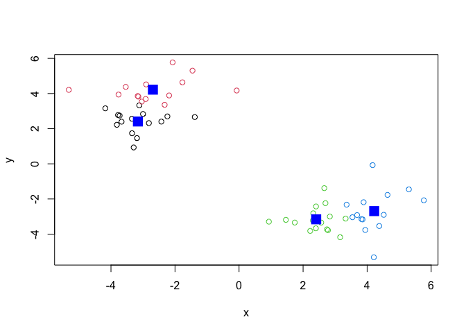

# Class 07: Machine Learning 1
Jessica PID: A15647602

Before we get into the clustering methods let’s make some sample data to
cluster where we know what the answer should be.

To help with this I will use the ‘rnorm()’ function.

``` r
hist( rnorm(150000, mean = c(-3)))
```


``` r
n = 10000
hist(c(rnorm(n, mean = 3), rnorm(n, mean = -3)))
```


``` r
hist( rnorm(150000, mean = c(-3, +3)))
```


``` r
n = 30
x <- c( rnorm(n, mean = 3), rnorm(n, mean = -3))
y <- rev(x)

z <- cbind(x, y)
plot(z)
```


## K-means clustering

The function in base R for k-means clustering is called `kmeans()`

``` r
km <- kmeans(z, centers = 2)
km
```

    K-means clustering with 2 clusters of sizes 30, 30

    Cluster means:
              x         y
    1 -2.939931  3.254707
    2  3.254707 -2.939931

    Clustering vector:
     [1] 2 2 2 2 2 2 2 2 2 2 2 2 2 2 2 2 2 2 2 2 2 2 2 2 2 2 2 2 2 2 1 1 1 1 1 1 1 1
    [39] 1 1 1 1 1 1 1 1 1 1 1 1 1 1 1 1 1 1 1 1 1 1

    Within cluster sum of squares by cluster:
    [1] 64.17433 64.17433
     (between_SS / total_SS =  90.0 %)

    Available components:

    [1] "cluster"      "centers"      "totss"        "withinss"     "tot.withinss"
    [6] "betweenss"    "size"         "iter"         "ifault"      

``` r
km$centers
```

              x         y
    1 -2.939931  3.254707
    2  3.254707 -2.939931

> 17. Print out the cluster membership vector (i.e our main answer)

``` r
km$cluster
```

     [1] 2 2 2 2 2 2 2 2 2 2 2 2 2 2 2 2 2 2 2 2 2 2 2 2 2 2 2 2 2 2 1 1 1 1 1 1 1 1
    [39] 1 1 1 1 1 1 1 1 1 1 1 1 1 1 1 1 1 1 1 1 1 1

``` r
plot(z, col = c("red", "blue"))
```


``` r
plot(x, col = c(1,2,3))
```


``` r
# color by number (1,2,3, etc.)
```

Plot this with clustering result and add cluster centers:

``` r
plot(z, col = km$cluster)
points(km$centers, col = "blue", pch = 17, cex = 2)
```


> Q. Can you cluster our data in `z` into four clusters please?

``` r
km4 <- kmeans(z, centers = 4)
plot(z, col = km4$cluster)
points(km4$centers, col = "blue", pch = 15, cex = 2)  
```



## Hierarchical Clustering

The main function for hierarchical clustering in base R is called
`hclust()` Unlike `kmeans()` I can not just pass in my data as input I
first need a distance matrix from my data.

``` r
d <- dist(z)
hc <- hclust(d)
hc
```


    Call:
    hclust(d = d)

    Cluster method   : complete 
    Distance         : euclidean 
    Number of objects: 60 

There is a specific hclust plot() method…

``` r
plot(hc)
abline(h = 10, col = "red")
```


To get my main clustering results (i.e. the membershp vector) I can
“cut” my tree at a given height. To do this I will use the `cutree()`

``` r
grps <- cutree(hc, h = 10)
grps
```

     [1] 1 1 1 1 1 1 1 1 1 1 1 1 1 1 1 1 1 1 1 1 1 1 1 1 1 1 1 1 1 1 2 2 2 2 2 2 2 2
    [39] 2 2 2 2 2 2 2 2 2 2 2 2 2 2 2 2 2 2 2 2 2 2

``` r
plot(z, col = grps)
```


## Principal Component Analysis (PCA)

\#PCA of UK food data

``` r
url <- "https://tinyurl.com/UK-foods"
x <- read.csv(url, row.names = 1)
```

Q1. How many rows and columns are in your new data frame named x? What R
functions could you use to answer this questions? \## Complete the
following code to find out how many rows and columns are in x?

``` r
nrow(x)
```

    [1] 17

``` r
ncol(x)
```

    [1] 4

``` r
dim(x)
```

    [1] 17  4

``` r
head(x)
```

                   England Wales Scotland N.Ireland
    Cheese             105   103      103        66
    Carcass_meat       245   227      242       267
    Other_meat         685   803      750       586
    Fish               147   160      122        93
    Fats_and_oils      193   235      184       209
    Sugars             156   175      147       139

``` r
barplot(as.matrix(x), beside=T, col=rainbow(nrow(x)))
```


``` r
barplot(as.matrix(x), beside=F, col=rainbow(nrow(x)))
```


``` r
pairs(x, col=rainbow(10), pch=16)
```


## PCA to the rescue

The main function to do PCA in base R is called `prcomp()`

Note that I need to take the transpose of this particular data as that
is what the`prcomp()` help page was asking for.

``` r
pca <- prcomp(t(x))
summary(pca)
```

    Importance of components:
                                PC1      PC2      PC3       PC4
    Standard deviation     324.1502 212.7478 73.87622 2.921e-14
    Proportion of Variance   0.6744   0.2905  0.03503 0.000e+00
    Cumulative Proportion    0.6744   0.9650  1.00000 1.000e+00

Let’s see what is inside our result object `pca` that we just
calculated:

``` r
attributes(pca)
```

    $names
    [1] "sdev"     "rotation" "center"   "scale"    "x"       

    $class
    [1] "prcomp"

``` r
pca$x
```

                     PC1         PC2        PC3           PC4
    England   -144.99315   -2.532999 105.768945 -9.152022e-15
    Wales     -240.52915 -224.646925 -56.475555  5.560040e-13
    Scotland   -91.86934  286.081786 -44.415495 -6.638419e-13
    N.Ireland  477.39164  -58.901862  -4.877895  1.329771e-13

To make our main result figure, called a “PC plot” (or “score plot”,
“ordination plot”, or “PC1 vs PC2 plot”).

``` r
plot(pca$x[,1], pca$x[,2], 
     col = c("black", "red", "blue", "darkgreen"), 
     pch =16, 
     xlab = "PC1 (67.4%)", ylab = "PC2 (29%)")
abline(h = 0, col = "gray", lty = 2)
abline(v = 0, col = "gray", lty = 2)
```


\##Variable loadings plot

Can give us insight on how the original variables vary.

``` r
par(mar=c(10, 3, 0.35, 0))
barplot( pca$rotation[,1], las=2 )
```


``` r
pca$rotation
```

                                 PC1          PC2         PC3          PC4
    Cheese              -0.056955380  0.016012850  0.02394295 -0.409382587
    Carcass_meat         0.047927628  0.013915823  0.06367111  0.729481922
    Other_meat          -0.258916658 -0.015331138 -0.55384854  0.331001134
    Fish                -0.084414983 -0.050754947  0.03906481  0.022375878
    Fats_and_oils       -0.005193623 -0.095388656 -0.12522257  0.034512161
    Sugars              -0.037620983 -0.043021699 -0.03605745  0.024943337
    Fresh_potatoes       0.401402060 -0.715017078 -0.20668248  0.021396007
    Fresh_Veg           -0.151849942 -0.144900268  0.21382237  0.001606882
    Other_Veg           -0.243593729 -0.225450923 -0.05332841  0.031153231
    Processed_potatoes  -0.026886233  0.042850761 -0.07364902 -0.017379680
    Processed_Veg       -0.036488269 -0.045451802  0.05289191  0.021250980
    Fresh_fruit         -0.632640898 -0.177740743  0.40012865  0.227657348
    Cereals             -0.047702858 -0.212599678 -0.35884921  0.100043319
    Beverages           -0.026187756 -0.030560542 -0.04135860 -0.018382072
    Soft_drinks          0.232244140  0.555124311 -0.16942648  0.222319484
    Alcoholic_drinks    -0.463968168  0.113536523 -0.49858320 -0.273126013
    Confectionery       -0.029650201  0.005949921 -0.05232164  0.001890737

``` r
par(mar=c(10, 3, 0.35, 0))
barplot( pca$rotation[,2], las=2 )
```


